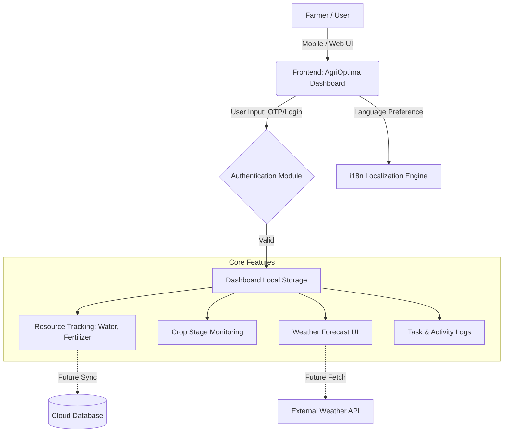

# AgriOptima - Intelligent Farm Resource Allocation Planner

## 1️⃣ Problem Statement
Agriculture faces critical challenges in resource management. Farmers often struggle to optimize water, fertilizer, and labor allocation due to a lack of precise data and real-time insights. 
- **The Problem**: Inefficient resource allocation leads to increased costs, reduced crop yield, and significant environmental impact.
- **Why it Exists**: Most farming decisions are still based on traditional heuristics rather than data-driven planning. Small to medium-scale farmers lack accessible, easy-to-use digital tools for precise resource tracking and forecasting.
- **Impact**: Poor resource management contributes to water scarcity, soil degradation (from over-fertilization), and decreased profitability for farmers, directly affecting global food security and economic stability in agricultural communities.

## 2️⃣ User Persona
- **Target User**: Small to medium-scale farmers, Farm Managers, and Agricultural Cooperatives.
- **Demographics**: Typically aged 25-60, with varying levels of technological literacy. Operating farms ranging from 5 to 50 acres.
- **Pain Points**:
  - Unpredictable weather conditions affecting irrigation and harvesting schedules.
  - Rising costs of agricultural inputs (fertilizers, water, labor).
  - Lack of a centralized system to track daily farming activities and expenses.
  - Difficulty in making data-backed decisions for crop rotation and resource allocation.

## 3️⃣ Solution Approach
  - **Frontend**: HTML5, CSS3 (Vanilla, custom Design System), JavaScript (ES6+ for interactive DOM manipulation).
  - **Database & Cloud**: Supabase (PostgreSQL) integration for real-time cloud sync, data persistence, and AI training data collection.
  - **Features**: Multi-language support (English, Hindi, Marathi, Tamil) for accessibility, responsive design for mobile and tablet use on the field, and local storage fallback for offline-capable data persistence.
  - **Integration Strategy**: Hybrid offline-first architecture using local storage with background synchronization to Supabase Cloud.

## 4️⃣ Architecture Diagram (Draft)

## 5️⃣ Future / Additional Features Identified
Based on current progress, the following features are planned for subsequent phases to enhance the Proof of Concept:
1. **Integrated AI Insights Engine**: Already prototyped in the UI, an intelligent system that analyzes resource constraints against weather patterns to provide real-time recommendations (e.g. "Severe Drought Warning - Switch to Drip Irrigation").
2. **Predictive Analytics model**: Machine learning models to aggressively predict crop yield based on historical collected weather and soil data.
3. **Data Collection Syncing**: Implement Service Workers to collect offline farm data and sync it seamlessly when connectivity is restored for better AI model training.
4. **Market Price Integration**: Live tracking of local crop market prices to advise farmers on the best time to sell.
5. **Automated Irrigation Control**: API hooks to connect the dashboard directly to IoT-enabled smart irrigation systems based on the AI outputs.

## 6️⃣ Initial Proof of Concept (Implemented)
The current repository contains an early working prototype showcasing:
- **Responsive Dashboard** (`index.html`): A comprehensive view of farm metrics, active tasks, resource levels, and upcoming weather.
- **Dynamic AI Analytics Panel**: Generates customized insights and alerts directly based on user inputs scaling mathematically against weather data. 
- **Cloud Sync Engine**: Integrated Supabase connectivity with a real-time status indicator (Synced/Syncing/Offline) ensuring data durability. 
- **Multilingual Support**: Fully operational language switching across the entire application to cater to diverse farming communities in India.
- **Authentication Flow** (`login.html`): Features secure PIN login with robust fallback OTP verification functionality if credentials are correct.
- **Scaled UI Architecture**: Robust modular structure (`config.js`, `database.js`, `app.js`) designed for high performance and visual clarity on multiple devices.

## Setup Instructions
To run the AgriOptima Proof of Concept locally:
1. Clone the repository to your local machine:
   `git clone <repository_url>`
2. Navigate to the project directory:
   `cd "Farm Resource Allocation Planner"`
3. No build tools or package managers are strictly required for the frontend PoC. Simply open `login.html` or `index.html` in any modern web browser.
4. (Optional) To view with local server routing: Start a local HTTP server:
   `python3 -m http.server 8000`
   Then navigate to `http://localhost:8000/login.html` in your browser.
